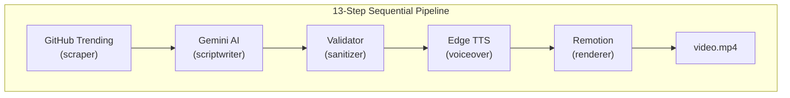

# DevByte Engine — V1

> Fully automated pipeline that turns GitHub Trending repositories into YouTube Shorts — zero human intervention.

DevByte Engine V1 is a programmatic video generation system that scrapes trending GitHub repositories, writes concise narrated scripts using Google Gemini, synthesizes neural speech via Edge TTS, and compiles everything into a finished 1080×1920 vertical MP4 using Remotion's code-first rendering engine.

---

## Architecture



Every module is a standalone CLI tool that reads a JSON file and writes a JSON file. The orchestrator chains them sequentially, checking outputs between steps.

---

## Key Capabilities

| Capability | Implementation |
|---|---|
| Content sourcing | Scrapes GitHub Trending via BeautifulSoup HTML parsing |
| Script generation | Google Gemini 1.5 Flash with structured hook → body → CTA prompts |
| Voice synthesis | Microsoft Edge TTS neural voices (free, no API key) |
| Video rendering | Remotion 4.x + React 19 — programmatic layout, dynamic timeline sync |
| Orchestration | Node.js CLI runner with timeout limits, retry logic, step-skipping |
| Logging | Chronological pipeline history with timestamped status markers |

---

## Tech Stack

| Layer | Technology |
|---|---|
| Runtime | Python 3.11, Node.js 18 |
| LLM | Google Gemini 1.5 Flash (`google-generativeai` SDK) |
| Voice | Edge TTS (Microsoft Azure Neural Voices) |
| Video | Remotion 4.x, React 19, TypeScript |
| Media | FFmpeg 6.x (globally installed) |
| Storage | File-based `.json` — no database |

---

## Repository Structure

```text
devbyte-engine/
├── config.json                      # Voice selection, timeouts, retry limits
├── package.json                     # Node dependencies and orchestrator scripts
├── .env                             # GEMINI_API_KEY (gitignored)
│
├── sources/
│   └── github.py                    # GitHub Trending scraper (BeautifulSoup)
│
├── services/
│   ├── gemini.py                    # Gemini SDK → structured script JSON
│   ├── tts.py                       # Edge TTS → audio.mp3
│   └── render.js                    # Node bridge → Remotion render command
│
├── orchestrator/
│   └── run_pipeline.js              # Sequential pipeline controller
│
├── utils/
│   ├── logger.py                    # Timestamped file + console logger
│   ├── validator.py                 # Post-LLM script sanitizer (ASCII-safe)
│   ├── config.py                    # config.json loader and validator
│   └── file_utils.py                # Absolute path and JSON read/write helpers
│
├── data/                            # Runtime artifacts (gitignored)
│   ├── trending.json                # Scraped GitHub results
│   ├── script.json                  # Raw AI-generated script
│   ├── validated_script.json        # Sanitized final script
│   ├── audio.mp3                    # Synthesized voiceover
│   └── video.mp4                    # Rendered final Short
│
├── logs/
│   └── pipeline.log                 # Appended execution trace
│
└── render/                          # Isolated Remotion project
    ├── remotion.config.ts           # Output specs, Webpack config
    ├── src/
    │   ├── Root.tsx                  # Video composition definitions
    │   ├── Composition.tsx          # V1 timeline layout
    │   └── components/
    │       ├── RepoTitle.tsx         # Animated fade-in repository title
    │       ├── CodePanel.tsx         # Auto-scrolling simulated VS Code panel
    │       └── SubtitleBar.tsx       # Synced terminal-style subtitle overlay
    └── ...
```

---

## Prerequisites

| Dependency | Verify with |
|---|---|
| Python 3.11+ | `python --version` |
| Node.js 18+ | `node --version` |
| FFmpeg 6+ | `ffmpeg -version` |

---

## Installation

```bash
# 1. Clone and initialize
git clone https://github.com/vishnu108shanker/Youtube-video-automation.git
cd Youtube-video-automation
mkdir data logs

# 2. Python dependencies
pip install python-dotenv google-generativeai requests beautifulsoup4 edge-tts

# 3. Node orchestrator dependencies
npm install

# 4. Remotion renderer dependencies
cd render && npm install && cd ..

# 5. Environment variables
echo GEMINI_API_KEY=your_key_here > .env
```

**Verify `config.json` exists** in the project root:
```json
{
  "source": "github",
  "tts_voice": "en-US-ChristopherNeural",
  "max_word_count": 95,
  "max_retries": 2,
  "subprocess_timeout_seconds": 30,
  "output_dir": "./data"
}
```

---

## Usage

### Full Pipeline (Fresh Run)

```bash
node orchestrator/run_pipeline.js --fresh
```

The `--fresh` flag clears cached runtime files from `data/` before launching. The pipeline executes all steps sequentially: scrape → script → validate → voiceover → render.

### Crash Recovery

```bash
node orchestrator/run_pipeline.js
```

Without `--fresh`, the orchestrator checks for existing output files (`trending.json`, `script.json`, etc.) and **skips completed steps**, resuming exactly where it left off.

### Running Modules Independently

Each module is a standalone CLI tool:

```bash
# 1. Scrape GitHub Trending
python sources/github.py --input config.json --output data/trending.json

# 2. Generate script via Gemini
python services/gemini.py --input data/trending.json --output data/script.json

# 3. Sanitize script for TTS
python utils/validator.py --input data/script.json --output data/validated_script.json

# 4. Synthesize voiceover
python services/tts.py --input data/validated_script.json --output data/audio.mp3

# 5. Render video
node services/render.js --input data/validated_script.json --audio data/audio.mp3 --output data/video.mp4
```

---

## Pipeline Flow

```text
sources/github.py          config.json → trending.json
        ↓
services/gemini.py         trending.json → script.json
        ↓
utils/validator.py         script.json → validated_script.json
        ↓
services/tts.py            validated_script.json → audio.mp3
        ↓
services/render.js         validated_script.json + audio.mp3 → video.mp4
```

Every arrow is a JSON file on disk. If the pipeline crashes at step 4, steps 1–3 are already saved and will be skipped on the next run.

---

## V1 Limitations (Addressed in V2)

- **Single source** — only GitHub Trending; no editorial variety
- **No content intelligence** — random selection based on whatever is trending
- **No history tracking** — no awareness of previously published topics
- **No publishing** — video must be manually uploaded to YouTube
- **Single video** — sequential pipeline produces one video per run

---

## License

Copyright © 2026 DevByte Engine. All rights reserved.
Proprietary and confidential.
