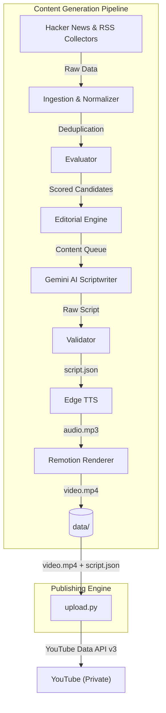

# DevByte Engine V2 (YouTube Shorts Automation)

An end-to-end automated pipeline that scrapes Hacker News and tech blogs, evaluates news with an editorial engine, uses Google Gemini to write engaging scripts, generates text-to-speech using Edge TTS, and renders highly aesthetic, premium SaaS-style YouTube Short videos automatically using Remotion.

## 🏗️ Architecture

The DevByte Engine follows a strict separation of concerns, divided into two primary subsystems: the **Generation Pipeline** and the **Publishing Engine**.



## 📋 Prerequisites

- **Python 3.9+**
- **Node.js 18+**
- **[FFmpeg](https://ffmpeg.org/download.html)** (Ensure it is in your system PATH)
- **Google Gemini API Key** (For script generation)
- **Google Cloud Console OAuth Credentials** (For YouTube publishing)

## 🛠️ Setup & Installation

1. **Clone the Repository**
   ```bash
   git clone https://github.com/vishnu108shanker/Youtube-video-automation.git
   cd Youtube-video-automation
   ```

2. **Environment Variables**
   Create a `.env` file in the root directory:
   ```env
   GEMINI_API_KEY=your_gemini_api_key_here
   ```

3. **Install Dependencies**
   ```bash
   # Python Dependencies
   pip install edge-tts google-generativeai requests beautifulsoup4 python-dotenv
   pip install google-api-python-client google-auth-httplib2 google-auth-oauthlib
   
   # Node Dependencies (Root & Render)
   npm install
   cd render
   npm install
   cd ..
   ```

4. **YouTube API Credentials**
   - Go to the Google Cloud Console, enable the **YouTube Data API v3**, and set up an OAuth Consent Screen.
   - Create an **OAuth Client ID** (Desktop App type).
   - Download the JSON file, rename it to `client_secrets.json`, and place it in the project root.

---

## 🚀 Running the Engine

### 1. The Generation Pipeline (13 Steps)
To run the entire automation process from scraping to video rendering:

**Fresh Run (Recommended)**
Use the `--fresh` flag to safely wipe previous temporary files and generate a brand new video.
```bash
node orchestrator/run_pipeline.js --fresh
```

**Resume/Crash Recovery Run**
Run without flags to pick up where a crashed pipeline left off:
```bash
node orchestrator/run_pipeline.js
```

### 2. The Publishing Engine
Once `video.mp4` and `script.json` are generated in the `data/` folder, run the publisher:
```bash
python services/upload.py
```
*(The first time you run this, a browser window will open to authenticate your Google Account. A `token.json` file will be saved for future runs. Videos are uploaded as **Private** by default).*

---

## 🎛️ Advanced Operations

### Automated Daily Scheduling (Windows)
A `run_automation.bat` file is included. Schedule it using Windows Task Scheduler to run the generation pipeline automatically:
```cmd
schtasks /create /tn "DevByteAutomation" /tr "\"C:\DEV\devilcode development\Devbyte-engine (youtube automation)\run_automation.bat\"" /sc daily /st 23:30 /f
```

### Previewing Video Visuals
If you want to edit the React Remotion components or preview the video without waiting for a full MP4 render:
```bash
cd render
npm run dev
```

### Running Modules Independently
If you are debugging or testing specific modules, you can run them manually:

**1. Scrape & Normalize**
```bash
python collectors/hackernews.py --input config.json --output data/temp_hn.json
python ingestion/normalizer.py --input data/temp_hn.json --output data/raw_candidates.json
```

**2. Editorial & Script Generation**
```bash
python editorial/editorial_engine.py --input data/raw_candidates.json --output data/content_queue.json --channel channels/ai_tools.json --policy editorial/editorial_policy.json --history data/history.json
node -e "const fs=require('fs'); fs.writeFileSync('data/selected_tool.json', JSON.stringify(JSON.parse(fs.readFileSync('data/content_queue.json'))[0], null, 2))"
python services/gemini.py --input data/selected_tool.json --output data/script.json
```

**3. Render Pipeline**
```bash
python services/tts.py --input data/script.json --output data/audio.mp3
node services/render.js --input data/script.json --audio data/audio.mp3 --output data/video.mp4
```

---

## 📂 Project Architecture

- `config.json`: Master configuration (voice selection, timeouts, retries).
- `orchestrator/run_pipeline.js`: The central task runner orchestrating the 13 Python/Node scripts.
- `services/upload.py`: The standalone V1 Publishing Engine.
- `render/`: The React Remotion environment responsible for the visual engine.
- `logs/pipeline.log`: Master log file tracking execution and errors.
- `data/`: Ephemeral folder where intermediate JSON files, audio, history, and the final `.mp4` are stored.


To run the entire automation process from start to finish, run the orchestrator script. 
---
### Fresh Run (Recommended)
Use the `--fresh` flag to safely wipe previous temporary files. The engine will scrape HN and blogs, run them through the editorial/scoring engine, write the script, and render a new vertical video.
## 🚀 Running the Engine
### 1. The Generation Pipeline (13 Steps)
To run the entire automation process from scraping to video rendering:
**Fresh Run (Recommended)**
Use the `--fresh` flag to safely wipe previous temporary files and generate a brand new video.
```bash
node orchestrator/run_pipeline.js --fresh
```
### Resume/Crash Recovery Run
Run without flags to pick up where a crashed pipeline left off (it will skip any step that already has a completed output file):
**Resume/Crash Recovery Run**
Run without flags to pick up where a crashed pipeline left off:
```bash
node orchestrator/run_pipeline.js
```
### 2. The Publishing Engine
Once `video.mp4` and `script.json` are generated in the `data/` folder, run the publisher:
```bash
python services/upload.py
```
*(The first time you run this, a browser window will open to authenticate your Google Account. A `token.json` file will be saved for future runs. Videos are uploaded as **Private** by default).*
---
## 🎛️ Advanced Operations
### Automated Daily Scheduling (Windows)
A `run_automation.bat` file is included in the project root. You can schedule this to run automatically using Windows Task Scheduler:
A `run_automation.bat` file is included. Schedule it using Windows Task Scheduler to run the generation pipeline automatically:
```cmd
schtasks /create /tn "DevByteAutomation" /tr "\"C:\DEV\devilcode development\Devbyte-engine (youtube automation)\run_automation.bat\"" /sc daily /st 23:30 /f
```
