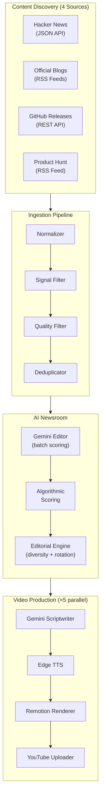

# DevByte Engine — V2
##### (pre dockerization version, to read the documentation of possible changes after containerization See [DOCKER_NOTES.md](docs_v2_Dockerization/DOCKER_NOTES.md) )
> An autonomous digital newsroom that discovers, evaluates, scripts, renders, and publishes developer-focused YouTube Shorts — entirely on autopilot.

DevByte Engine V2 transforms the original single-source video pipeline into a production-grade content automation system. It pulls from four independent news sources, filters noise with rule-based signal detection, scores candidates through an AI editorial layer, writes scripts using category-specific prompts, renders up to five videos in parallel, and publishes them directly to YouTube.

### Editorial Mission

> *DevByte covers products, releases, tools, developer infrastructure, AI breakthroughs, and major engineering announcements — not essays, tutorials, opinion pieces, or long-form discussions.*

---

## Architecture



---

## What Changed from V1

| Aspect | V1 | V2 |
|---|---|---|
| Sources | GitHub Trending only | HN + Blogs + GitHub Releases + Product Hunt |
| Selection | Random trending repo | AI-scored editorial queue with category rotation |
| Filtering | None | Signal filter → Quality filter → Deduplicator |
| Output | 1 video (sequential) | Up to 5 videos (parallel workers) |
| Publishing | Manual upload | Automated YouTube API upload |
| History | None | Append-only ledger preventing repeat coverage |
| Prompts | Single generic template | 8 category-specific editorial prompts |

The V1 rendering pipeline (Gemini → Validator → TTS → Remotion) is **completely unchanged**. V2 adds everything *before* Gemini and *after* the render.

---

## Key Capabilities

### Content Discovery
- **4 independent collectors** querying official APIs, RSS feeds, and release endpoints
- **Configurable sources** — add new blogs, repos, or filter keywords by editing JSON files in `sources/`
- **Signal filter** with HN keyword whitelists and global noise blacklists (blocks tutorials, guides, essays, roundups)

### AI Newsroom
- **Batch Gemini evaluation** — all candidates scored in a single API call as a "YouTube Shorts Editor" (0–100 + reason)
- **Multi-dimensional scoring** — combines editor score with freshness, popularity, source tier trust, and cross-source validation
- **Editorial rotation** — balances daily output across 8 content categories using publishing history
- **Source diversity limit** — max 2 stories per source in a single daily batch
- **Breaking news override** — high-scoring announcements (85+) bypass category rotation

### Production & Publishing
- **Parallel batch processing** — 5 isolated worker directories rendering simultaneously
- **20+ animated React components** — spring physics, frosted glass, mesh gradients, typewriter subtitles
- **Automated YouTube upload** — OAuth 2.0 integration, private staging, dynamic metadata injection

---

## Tech Stack

| Layer | Technology |
|---|---|
| Runtime | Python 3.11, Node.js 18 |
| LLM | Google Gemini 2.5 Flash / 3.5 Flash (automatic fallback) |
| Voice | Edge TTS (Microsoft Azure Neural Voices) |
| Video | Remotion 4.x, React 19, Tailwind CSS v4, TypeScript |
| Publishing | YouTube Data API v3 (resumable uploads) |
| Media | FFmpeg 6.x |
| Storage | File-based JSON — append-only history ledger |

---

## Repository Structure

```text
devbyte-engine/
├── config.json                          # Voice, timeouts, retry limits
├── package.json                         # Node deps — npm run batch
├── .env                                 # GEMINI_API_KEY (gitignored)
├── client_secrets.json                  # YouTube OAuth credentials (gitignored)
├── token.json                           # Saved YouTube access token (gitignored)
│
├── sources/                             # Editable newsroom configuration
│   ├── official_feeds.json              #   RSS feed registry (8 blogs)
│   ├── github_repos.json                #   Tracked GitHub repositories (8 repos)
│   ├── filters.json                     #   HN whitelist + global noise blacklist
│   └── github.py                        #   Legacy V1 GitHub Trending scraper
│
├── collectors/                          # Source-specific data fetchers
│   ├── hackernews.py                    #   HN Top Stories JSON API
│   ├── blogs.py                         #   RSS aggregator (OpenAI, Anthropic, etc.)
│   ├── github_releases.py              #   GitHub /releases/latest API
│   └── product_hunt.py                  #   Product Hunt RSS feed
│
├── ingestion/                           # Data cleaning pipeline
│   ├── normalizer.py                    #   Maps all sources → unified schema
│   ├── signal_filter.py                 #   Keyword whitelist/blacklist gatekeeper
│   ├── quality_filter.py                #   Drops malformed or thin candidates
│   └── deduplicator.py                  #   Story-level dedup (ID, URL, title)
│
├── evaluation/                          # Scoring and ranking
│   ├── evaluator.py                     #   Batch Gemini editorial scoring
│   └── scoring.py                       #   Freshness, popularity, trust formulas
│
├── editorial/                           # Content decisions
│   ├── editorial_engine.py              #   Queue builder (rotation + diversity)
│   ├── editorial_policy.json            #   Category weights and thresholds
│   └── prompts/                         #   Category-specific Gemini prompts
│       ├── update.txt                   #     Breaking news / releases
│       ├── free_alternative.txt         #     "Stop paying for X"
│       ├── hidden_gem.txt               #     "Nobody is talking about this"
│       ├── productivity.txt             #     "Saves 2 hours a day"
│       ├── comparison.txt               #     "ChatGPT vs Claude"
│       ├── weekly_roundup.txt           #     "5 AI tools this week"
│       ├── best_for.txt                 #     "Best AI for students"
│       └── prompt_trick.txt             #     "One prompt that saves hours"
│
├── channels/
│   └── ai_tools.json                    # Channel identity, tone, template map
│
├── services/                            # Core production services
│   ├── gemini.py                        #   Script + metadata generator
│   ├── tts.py                           #   Text-to-speech compiler
│   ├── render.js                        #   Remotion video renderer
│   └── upload.py                        #   YouTube API uploader
│
├── orchestrator/                        # Pipeline controllers
│   ├── run_pipeline.js                  #   Sequential single-video runner
│   └── batch_generate_and_upload.js     #   Parallel 5-worker batch executor
│
├── utils/                               # Shared helpers
│   ├── logger.py                        #   Timestamped file + console logger
│   ├── validator.py                     #   Post-LLM script sanitizer
│   ├── config.py                        #   config.json loader
│   └── file_utils.py                    #   Path and JSON read/write helpers
│
├── data/                                # Runtime artifacts (gitignored)
│   ├── history.json                     #   Permanent publish ledger (append-only)
│   ├── raw_candidates.json              #   Post-ingestion candidates
│   ├── evaluated_candidates.json        #   Post-scoring candidates
│   ├── content_queue.json               #   Editorial-selected queue
│   ├── selected_tool.json               #   Current video target
│   ├── script.json / audio.mp3          #   Per-video production artifacts
│   └── worker_0/ ... worker_4/          #   Parallel batch worker directories
│
└── render/                              # Remotion video engine
    ├── remotion.config.ts               #   1080×1920 output, Tailwind, Webpack
    └── src/
        ├── Root.tsx                      #   Dynamic duration compositions
        ├── design/
        │   └── theme.ts                 #   Colors, typography, spacing tokens
        ├── backgrounds/
        │   ├── AnimatedMeshGradient.tsx  #   Floating sinusoidal mesh panels
        │   ├── DarkNoise.tsx            #   Glass-texture dark overlay
        │   ├── RadialGlow.tsx           #   Radial light source effect
        │   └── Grid.tsx                 #   Digital alignment grid
        ├── effects/
        │   ├── GlassMorphism.tsx        #   Frosted glass surface
        │   ├── Glow.tsx                 #   Neon glow border
        │   └── LightSweep.tsx           #   Horizontal light sweep
        ├── motion/
        │   ├── Fade.tsx / Slide.tsx      #   Entry animations
        │   ├── Scale.tsx / Pop.tsx       #   Attention animations
        │   ├── GlowPulse.tsx            #   Pulsing highlight
        │   ├── CountUp.tsx              #   Animated number counter
        │   └── Typewriter.tsx           #   Character-by-character reveal
        ├── components/
        │   ├── BrowserWindow.tsx        #   Chrome-style browser frame
        │   ├── TerminalWindow.tsx       #   macOS terminal frame
        │   ├── ToolCard.tsx             #   Product info card
        │   ├── FeatureChip.tsx          #   Pill-shaped feature tag
        │   ├── SubtitleBar.tsx          #   TTS-synced subtitle overlay
        │   └── ...
        ├── scenes/
        │   └── HeroScene.tsx            #   Full-screen title reveal
        └── templates/
            ├── FreeAlternative.tsx       #   5-scene vertical video composition
            └── Stubs.ts                 #   Template routing for other categories
```

---

## Prerequisites

| Dependency | Verify with |
|---|---|
| Python 3.11+ | `python --version` |
| Node.js 18+ | `node --version` |
| FFmpeg 6+ | `ffmpeg -version` |

---

## Installation

```bash
# 1. Clone and initialize
git clone https://github.com/vishnu108shanker/Youtube-video-automation.git
cd Youtube-video-automation
mkdir -p data logs

# 2. Python dependencies
pip install python-dotenv google-genai requests beautifulsoup4 edge-tts feedparser python-slugify google-auth google-auth-oauthlib google-api-python-client

# 3. Node orchestrator dependencies
npm install

# 4. Remotion renderer dependencies
cd render && npm install && cd ..
```

### API Credentials

**Gemini** — create `.env` in the project root:
```env
GEMINI_API_KEY=your_google_gemini_api_key_here
```

**YouTube** — for automated publishing:
1. Enable the **YouTube Data API v3** in Google Cloud Console
2. Create an **OAuth 2.0 Client ID** (Desktop application)
3. Download the credentials JSON, rename to `client_secrets.json`, place in project root
4. On first upload, a browser window opens for authentication — `token.json` is saved for future runs

**Initialize the history ledger:**
```bash
echo [] > data/history.json
```

---

## Usage

### Batch Production (Recommended)

The primary workflow — ingests from all sources, filters, scores, generates up to 5 videos in parallel, and uploads to YouTube:

```bash
npm run batch
```

This executes two phases:
1. **Phase 1** — Collect → Normalize → Signal Filter → Quality Filter → Deduplicate → Evaluate → Editorial Queue
2. **Phase 2** — For each of the top 5 candidates: Script → Validate → TTS → Render → Upload

### Single Video Pipeline

For debugging or manual runs, the sequential pipeline generates one video:

```bash
node orchestrator/run_pipeline.js --fresh
```

Without `--fresh`, the orchestrator skips completed steps and resumes from the last failure point.

### Running Modules Independently

Every Python module accepts `--input` and `--output` flags:

```bash
# Collect from one source
python collectors/hackernews.py --input config.json --output data/temp_hn.json

# Run the full ingestion chain
python ingestion/normalizer.py --input data/temp_hn.json --output data/raw_candidates.json
python ingestion/signal_filter.py --input data/raw_candidates.json --output data/raw_candidates.json
python ingestion/quality_filter.py --input data/raw_candidates.json --output data/raw_candidates.json
python ingestion/deduplicator.py --input data/raw_candidates.json --output data/raw_candidates.json

# Score and select
python evaluation/evaluator.py --input data/raw_candidates.json --output data/evaluated_candidates.json
python editorial/editorial_engine.py --input data/evaluated_candidates.json --output data/content_queue.json \
  --channel channels/ai_tools.json --policy editorial/editorial_policy.json --history data/history.json

# Generate a video from the top candidate
python services/gemini.py --input data/selected_tool.json --output data/script.json
python utils/validator.py --input data/script.json --output data/validated_script.json
python services/tts.py --input data/validated_script.json --output data/audio.mp3
node services/render.js --input data/validated_script.json --audio data/audio.mp3 --output data/video.mp4
```

---

## Customizing the Newsroom

All editorial behavior is controlled through JSON configuration files — no code changes required.

| What | File | Example |
|---|---|---|
| Add an RSS feed | `sources/official_feeds.json` | Append `{"url": "https://blog.example.com/rss", "source": "example_blog"}` |
| Track a GitHub repo | `sources/github_repos.json` | Append `"owner/repo"` to the array |
| Block noise keywords | `sources/filters.json` | Add words to `noise_blacklist` array |
| Allow HN topics | `sources/filters.json` | Add verbs to `whitelist_keywords` array |
| Adjust category weights | `editorial/editorial_policy.json` | Change percentage values in `weights` |
| Change TTS voice | `config.json` | Set `tts_voice` to any Edge TTS voice name |
| Edit video colors | `render/src/design/theme.ts` | Modify palette, typography, or spacing tokens |
| Tune score thresholds | `editorial/editorial_policy.json` | Adjust `min_score_threshold` or `breaking_news_override_score` |

### Automated Scheduling (Windows)

A `run_automation.bat` is included. Schedule it with Windows Task Scheduler:

```cmd
schtasks /create /tn "DevByteAutomation" /tr "\"C:\path\to\run_automation.bat\"" /sc daily /st 23:30 /f
```

---

## Pipeline Data Flow

```text
                        ┌─────────────┐
                        │  4 Sources  │
                        └──────┬──────┘
                               ↓
               ┌───────────────────────────────┐
               │       Normalizer              │  62 raw candidates
               │       Signal Filter           │  → 46 after noise removal
               │       Quality Filter          │  → 43 after validation
               │       Deduplicator            │  → 43 unique stories
               └───────────────┬───────────────┘
                               ↓
               ┌───────────────────────────────┐
               │       Gemini Editor (batch)   │  editor_score 0–100
               │       Algorithmic Scoring     │  freshness + popularity + trust
               │       Editorial Engine        │  top 5, diversity-capped
               └───────────────┬───────────────┘
                               ↓
               ┌───────────────────────────────┐
               │     5 Parallel Workers        │
               │     Script → TTS → Render     │
               │     → Upload to YouTube       │
               └───────────────────────────────┘
```

---

## Scoring Formula

```
Total Score = Base Score × (editor_score / 100)

Base Score  = Freshness + Popularity + Source Trust + Quality + Hype Bonus

Freshness:     < 7 days → 40  |  < 30 days → 25  |  < 90 days → 10
Popularity:    min(30, raw_count / 100)
Source Trust:   Tier 1 → 20  |  Tier 2 → 15  |  Tier 3 → 10
Quality:       competitors +10  |  use_cases +10  |  audience +5  |  cross-source +15
Hype Bonus:    title contains high-profile keyword → +25
```

The `editor_score` is Gemini's assessment of video-worthiness. Python enforces `min_score_threshold` from `editorial_policy.json` — the LLM scores, but code decides.

---

## Content Categories

| Category | Hook Style | Example |
|---|---|---|
| `update` | Breaking news | "OpenAI just released..." |
| `free_alternative` | Cost savings | "Stop paying for X" |
| `hidden_gem` | Curiosity | "Nobody is talking about this" |
| `productivity` | Time savings | "Saves 2 hours a day" |
| `comparison` | Decision help | "ChatGPT vs Claude" |
| `weekly_roundup` | Breadth | "5 AI tools this week" |
| `best_for` | Search intent | "Best AI for students" |
| `prompt_trick` | Engagement | "One prompt that saves hours" |

Each category has a dedicated prompt template in `editorial/prompts/` that shapes the scriptwriting style, hook formula, and body structure.

---

## Version History

| Version | Date | Highlights |
|---|---|---|
| **2.2.1** | Jul 4, 2026 | Deduplicator rewrite (story-level identity), source diversity cap |
| **2.2.0** | Jul 4, 2026 | Newsroom overhaul — 4 sources, signal filter, batch Gemini scoring |
| **2.1.0** | Jul 4, 2026 | Queue truncation fix, hype bonus, prompt persona refinement |
| **2.0.0** | Jun 23, 2026 | Full architectural rewrite — editorial engine, parallel batch, YouTube upload |
| **1.0.0** | Jun 2026 | Initial pipeline — GitHub Trending → Gemini → TTS → Remotion |

See [DEVLOG.md](docs_v2/DEVLOG.md) for detailed changelogs.

---

## License

Copyright © 2026 DevByte Engine. All rights reserved.
Proprietary and confidential. Unauthorized duplication, modification, or distribution is strictly prohibited.
